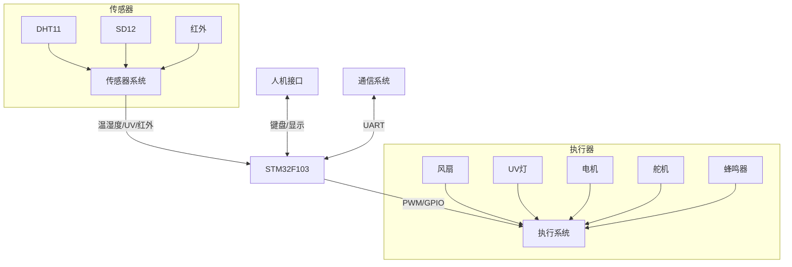

# SmartEnvGuard (智环卫士)


基于STM32F103C8T6的智能环境监控系统，集成温湿度检测、紫外线感应、红外触发与多模式控制功能，支持蓝牙远程交互。
作者：DikiFive（全平台同名）

[English Document](README_EN.md) | [项目文档](docs/) | [演示视频](#)

## 目录
- [核心功能](#核心功能)
- [安全保护](#安全保护)
- [硬件架构](#硬件架构)
- [快速开始](#快速开始)
- [开发指南](#开发指南)
- [通信协议](#通信协议)
- [贡献指南](#贡献指南)
- [许可证](#许可证)

## 安全保护 🛡️

### 1. 自动保护机制
- DHT11读取失败时保持使用上次有效数据
- DHT11故障累计3次才显示ERR，避免显示闪烁
- 模式切换时自动关闭所有设备
- 每100ms采样一次数据，避免频繁读取

### 2. 硬件安全限制
- 红外触发的UV灯最大工作时间限制为2秒
- 风扇低电平触发设计，断电自动关闭
- 电机具备过流保护功能
- 蓝牙通信带有校验和机制

### 3. 调试支持
- 温湿度数据支持固定值模式用于测试
- 串口实时监控系统状态
- OLED显示所有关键参数
- LED指示灯反馈系统工作状态

## 核心功能 🚀
### 1. 环境感知
- **温湿度监测(DHT11)**
  - 温度测量范围：0-50℃（±2℃精度）
  - 湿度测量范围：20-90%RH（±5%精度）
  - 采样周期：100ms
- **紫外线检测(SD12)**
  - 11级强度分级（0-11）
  - 12位ADC采样（分辨率0.001V）
- **红外人体感应**
  - 触发响应时间<0.5s
  - 支持上升/下降沿触发
  - 最大感应距离：5米

### 2. 多模式控制
1. **手动模式（MANUAL）**
   - 通过4x4矩阵键盘直接控制设备：
     * 按键1/2：蜂鸣器开关
     * 按键3/4：风扇开关
     * 按键5/6：紫外线灯开关
     * 按键7/8/9：电机控制（正转/反转/停止）
     * 按键10/11/12：舵机控制（0°/90°/180°）
     * 按键13-15：温湿度固定值切换

2. **自动模式（AUTO）**
   - 温度>31℃且湿度>61%时自动开启风扇和UV灯
   - 检测到红外触发时，开启UV灯2秒并控制舵机转到90°

3. **循环模式（CYCLE）**
   - 5秒工作周期自动调度：
     * 前5秒：开启风扇、UV灯、电机正转
     * 后5秒：关闭所有设备

4. **蓝牙模式（BT）**
   - 实时数据上传（温度、湿度、UV等级）
   - 支持远程控制所有执行器
   - 可通过APP切换工作模式

### 3. 执行系统
- **直流电机**：20KHz PWM调速，支持正反转
- **9g舵机**：50Hz PWM，0-180°角度控制
- **紫外线消毒灯**：带2秒安全限制
- **散热风扇**：低电平触发
- **蜂鸣器**：>85dB @10cm，异常报警
- **双色LED**：系统状态指示

### 4. 人机交互
- **0.96寸OLED显示屏**
  - 4行状态信息实时更新：
    * 第1行：按键值、红外状态、DHT11状态
    * 第2行：湿度值
    * 第3行：温度值和UV等级
    * 第4行：运行时间、蓝牙状态、工作模式
## 硬件架构 🧩

### 系统框图


### 接口定义
1. **通信接口**
   | 功能 | 引脚 | 说明 |
   |------|------|------|
   | USART1-TX/RX | PA9/10 | 调试串口(115200bps) |
   | USART2-TX/RX | PA2/3 | 蓝牙通信(9600bps) |
   | I2C-SCL/SDA | PB8/9 | OLED显示(软件模拟) |

2. **传感器接口**
   | 功能 | 引脚 | 说明 |
   |------|------|------|
   | DHT11 | PB0 | 温湿度传感器(单总线) |
   | SD12 | PA0 | 紫外线ADC输入 |
   | RED | PA7 | 红外传感器(边沿触发) |

3. **控制输出**
   | 功能 | 引脚 | 说明 |
   |------|------|------|
   | Fan | PC15 | 风扇控制(低电平) |
   | UV LED | PA12 | 紫外线灯控制 |
   | Motor | PA4-6 | 电机控制(方向+PWM) |
   | Servo | PA1 | 舵机PWM控制 |
   | Buzzer | PC14 | 蜂鸣器控制 |

4. **按键和LED**
   | 功能 | 引脚 | 说明 |
   |------|------|------|
   | 键盘行线 | PA8-11 | 矩阵键盘扫描(输出) |
   | 键盘列线 | PB12-15 | 矩阵键盘扫描(输入) |
   | System LED | PC13 | 系统状态指示 |

## 快速开始 ⚡

### 1. 开发环境搭建
```bash
# 1. 安装开发工具
- 安装Keil uVision5（建议V5.38+）
- 安装STM32 ST-LINK驱动
- 可选：安装VSCode + Embedded IDE插件

# 2. 获取代码
git clone https://github.com/yourusername/SmartEnvGuard.git

# 3. 导入工程
- 打开Project/SmartEnvGuard.uvprojx
- 编译并确认无错误
```

### 2. 硬件准备
1. **核心板**
   - STM32F103C8T6最小系统板
   - USB-TTL下载器
   - 供电：5V USB或3.3V外部电源

2. **传感器模块**
   - DHT11温湿度传感器
   - SD12紫外线传感器
   - HC-SR501人体红外传感器

3. **执行器**
   - 5V直流风扇
   - UV-LED灯带（12V）
   - SG90舵机
   - 有刷直流电机

4. **显示与输入**
   - 0.96寸OLED (SSD1306)
   - 4x4矩阵键盘
   - HC-05蓝牙模块

### 3. 接线说明
```c
/* 核心连接示意 */
// 电源
VDD_3V3 --> 传感器供电
GND     --> 公共地

// 传感器
PA0  --> SD12输出
PB0  --> DHT11数据
PA7  --> 红外传感器输出

// 执行器
PC15 --> 风扇控制（低电平有效）
PA12 --> UV灯控制
PA4  --> 电机方向1
PA5  --> 电机方向2
PA6  --> 电机PWM
PA1  --> 舵机PWM

// 通信
PA9/10 --> USB转TTL (调试)
PA2/3  --> 蓝牙模块
PB8/9  --> OLED显示屏
```

## 开发指南 🔧

### 1. 外设配置
1. **定时器**
   ```c
   // TIM2 - 舵机控制
   - 频率：50Hz (20ms周期)
   - 占空比：0.5ms-2.5ms (0-180度)

   // TIM3 - 电机控制
   - 频率：20KHz
   - 占空比：0-100%调速

   // TIM4 - 系统定时
   - 周期：1ms
   - 优先级：2-0
   ```

2. **ADC配置**
   ```c
   // ADC1 - UV传感器
   - 时钟：12MHz (72MHz/6)
   - 分辨率：12位
   - 采样时间：55.5周期
   - 转换模式：单次转换
   ```

3. **串口配置**
   ```c
   // USART1 - 调试
   - 波特率：115200
   - 数据位：8
   - 停止位：1
   - 校验位：无

   // USART2 - 蓝牙
   - 波特率：9600
   - 数据位：8
   - 停止位：1
   - 校验位：无
   ```

### 2. 中断处理
- **定时器中断(1ms)**
  - 更新系统时间
  - 处理按键扫描
  - 执行自动控制任务

- **外部中断**
  - 红外传感器(EXTI7)：响应人体感应
  - 优先级：1-1

### 3. 调试方法
1. **串口调试**
   ```shell
   # 数据监视（115200bps）
   printf("Temp:%.1f Hum:%.1f UV:%d", temp, hum, uv_level);
   ```

2. **显示调试**
   - OLED实时显示系统状态
   - LED指示器：
     * PC13：系统运行指示
     * 双色LED：自定义状态

3. **软件调试**
   - 支持SWD在线调试
   - 支持串口烧录：
     ```shell
     # 进入烧录模式
     AT+BOOT
     ```
## 通信协议 📡

### 1. 蓝牙通信规范
- 波特率：9600bps
- 帧格式：固定帧头(0xA5)和帧尾(0x5A)
- 校验方式：和校验（不含帧头帧尾）

### 2. 数据帧格式

1. **发送帧（20字节）**
   ```python
   帧结构：0xA5 + [数据] + [校验和] + 0x5A

   [数据] = {
     COUNT(1字节)     : 计数值，用于丢包检测
     UV_LEVEL(1字节)  : 紫外线等级(0-11)
     HUM(4字节)       : 湿度值(float)
     TEMP(4字节)      : 温度值(float)
   }
   ```

2. **接收帧（6字节）**
   ```python
   帧结构：0xA5 + [控制标志] + [校验和] + 0x5A

   [控制标志] = {
     Bit7    : UV灯控制(1=开启,0=关闭)
     Bit6-5  : 舵机角度(00=0°,01=90°,10=180°)
     Bit4    : 风扇开关(1=启动)
     Bit3-2  : 电机控制(00=停止,01=正转,10=反转)
     Bit1-0  : 工作模式(00=手动,01=自动,10=循环,11=蓝牙)
   }
   ```

### 3. 通信示例
```python
# 发送传感器数据
发送: A5 01 05 42 48 66 66 41 F0 00 00 7F 5A
     [头][计数][UV][  湿度  ][   温度   ][校验][尾]

# 接收控制命令
接收: A5 C2 C2 5A
     [头][控制][校验][尾]
     控制值说明：1100 0010
       - UV灯开启(1)
       - 舵机90度(10)
       - 风扇关闭(0)
       - 电机停止(00)
       - 自动模式(10)
```

## 贡献指南 🤝

### 1. 参与方式
- 提交Issue报告问题或提出新功能建议
- Fork后提交Pull Request贡献代码
- 完善文档翻译（中英双语）
- 优化代码结构和性能
- 添加新的传感器支持

### 2. 开发规范
1. **命名规范**
   - 变量：小写字母+下划线（例：system_status）
   - 常量：大写字母+下划线（例：MAX_TEMP_VALUE）
   - 函数：动词+名词（例：get_temp_value）

2. **注释规范**
   ```c
   /**
    * @brief   函数功能简述
    * @param   参数说明
    * @retval  返回值说明
    * @note    注意事项说明
    */
   ```

3. **代码风格**
   - 使用4空格缩进
   - 运算符两侧加空格
   - 每行不超过80字符
   - 函数不超过50行

4. **版本控制**
   - 功能开发使用feature分支
   - Bug修复使用hotfix分支
   - 提交信息使用统一格式：
     * feat: 新功能
     * fix: 修复问题
     * docs: 文档更新
     * style: 代码格式调整
     * refactor: 代码重构

## 许可证 📜
本项目采用MIT许可证，详见LICENSE文件。
